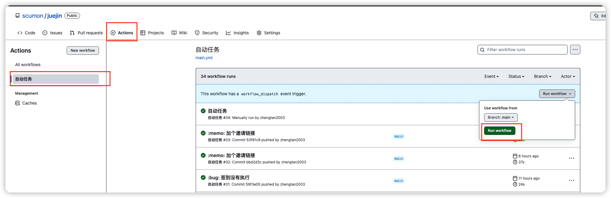
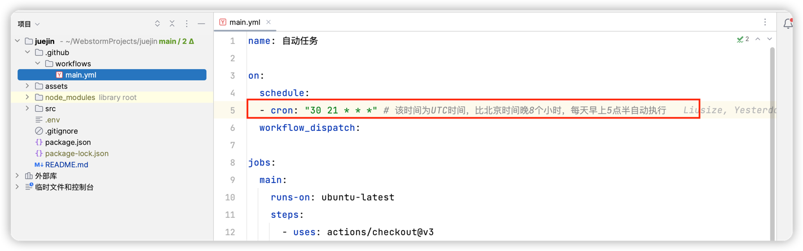
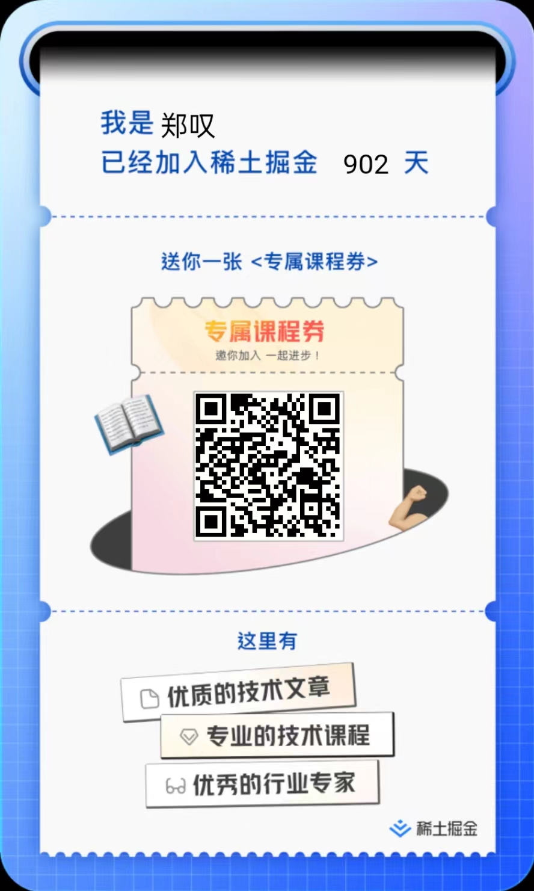

# 

## 任务列表
| 任务名称      | 支持情况 | Secrets                  |
|-----------|------|--------------------------|
| 签到        | ✅    | `REQUIRED_PARAMS.cookie` |
| 抽奖        | ✅    | `REQUIRED_PARAMS.cookie` |
| 沾喜气       | ✅    | `REQUIRED_PARAMS.cookie` |
| 海底掘金      | ✅    | `REQUIRED_PARAMS.cookie` |
| 飞书webhook | ✅    | `WEBHOOK_FEISHU`         |

## 如何使用
### 一、Fork此仓库

### 二、设置Secrets

### 三、设置Actions

### 四、主动触发执行

### 五、定时执行

## 如果是新用户可走我的链接

