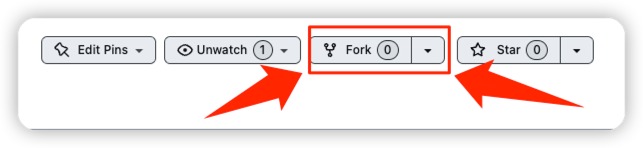
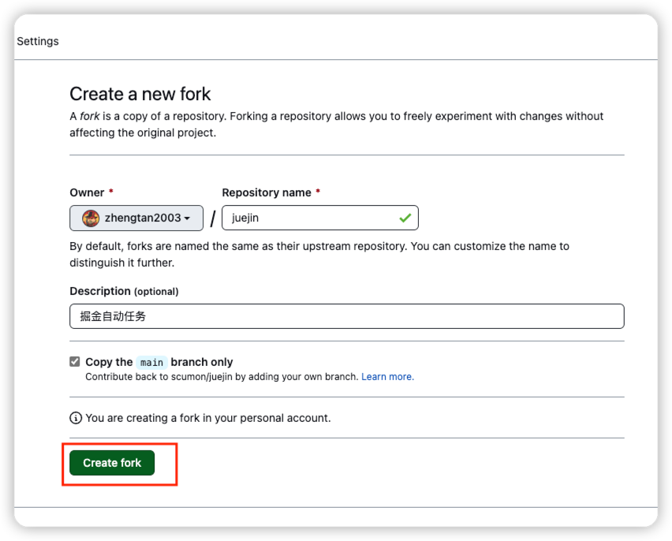
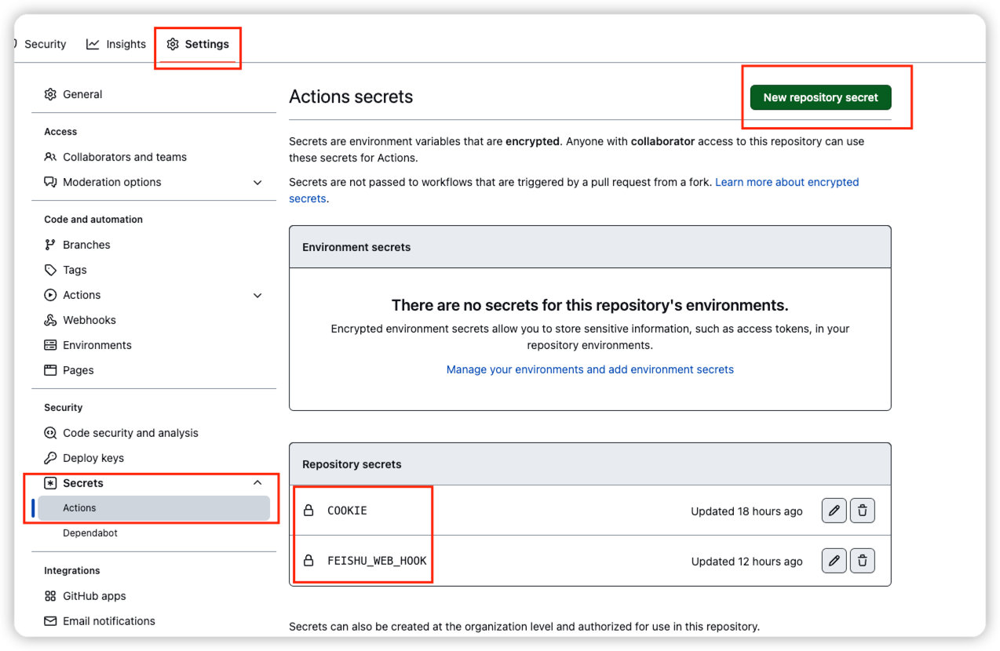
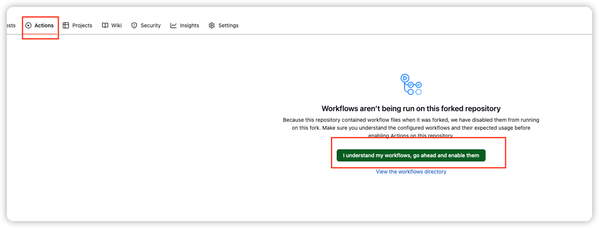

# juejin
每天定时执行

## 任务列表
| 任务名称      | 支持情况 | Secrets         |
|-----------|------|-----------------|
| 签到        | ✅    | COOKIE          |
| 抽奖        | ✅    | COOKIE          |
| 沾喜气       | ✅    | COOKIE          |
| 飞书webhook | ✅    | FEISHU_WEB_HOOK |

## 如何使用
### 一、Fork此仓库

### 二、设置Secrets

### 三、设置Actions

### 四、主动触发执行
修改任意位置，提交到main分支，即可触发任务开始
在Actions中能看到执行结果

## 如果是新用户可走我的链接

